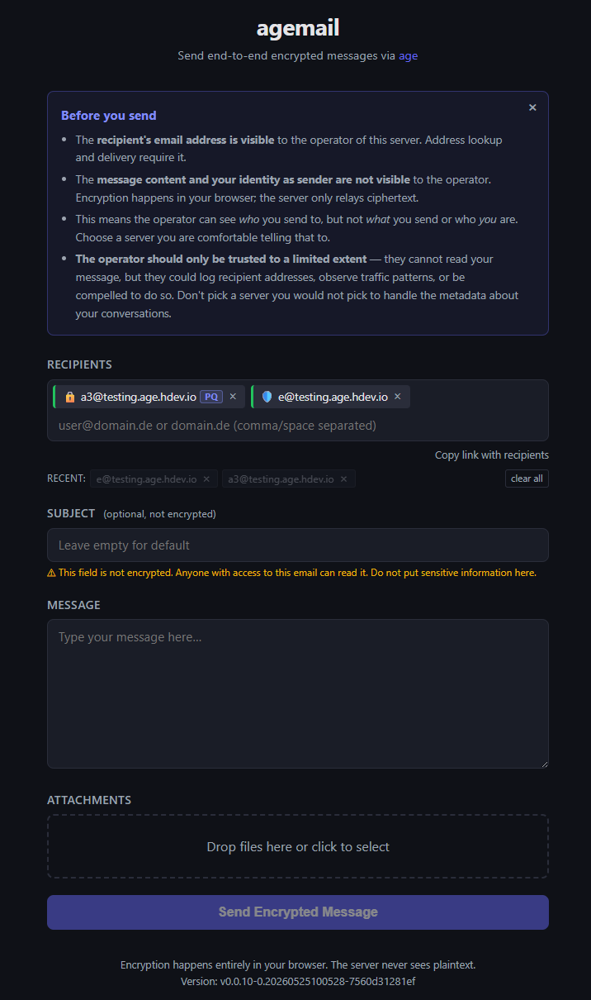

# age-web-gateway

[](https://github.com/dhcgn/age-web-gateway/actions/workflows/ci.yml)
[](https://github.com/dhcgn/age-web-gateway/actions/workflows/release.yml)
[](https://goreportcard.com/report/github.com/dhcgn/age-web-gateway)

[](https://github.com/dhcgn/age-web-gateway/releases)
[](https://age.hdev.io/)
[](https://github.com/dhcgn/age-web-gateway/pkgs/container/age-web-gateway)


A self-hostable web gateway to send age-encrypted messages and files.

Try it live: https://age.hdev.io/

## Motivation

Sometime you want to offer a simple way for users to send encrypted messages to a recipient without requiring them to have their own email address or encryption keys. This project provides a web interface where users can enter a recipient address and send encrypted content without needing to manage their own keys or email accounts.

> The recipient most only needs to publish their age public key.

This project makes encrypted sending simple for normal users:
- Major use case: someone wants to receive information by mail and publish only an age public key, without forcing senders to disclose their own mail address.
- Senders just open the webpage, enter an email-like recipient address, and send encrypted content.
- Senders do not need their own email address or their own age key to send.
- Discover recipient keys from recipient-owned DNS or HTTPS records
- Encrypt everything in the browser
- Relay only ciphertext through your server

Important: message body, file names, and file contents are encrypted in the browser before upload. The backend never sees plaintext content.

## Browser-side encryption security

This is browser-based encryption. Plaintext is encrypted on the sender device before upload, so the server, SMTP provider, and transport path only receive ciphertext.

Be clear about limits: malicious browser extensions, compromised endpoints, or malicious server-delivered frontend code can still break security.

## Screenshot



## How users interact

1. Open the web UI.
2. Enter one or more recipients.
3. The client resolves keys and shows a trust level per recipient.
4. Type a message and add files.
5. The browser encrypts to recipient public keys (classic or PQ).
6. A proof-of-work is solved.
7. Only encrypted payloads are sent to the backend, then relayed via encrypted SMTP transport or Cloudflare Email API over TLS.

You can send anonymous age-encrypted messages and attachments to recipients who published public keys.

## Recipient trust levels

Recipients can have different security levels depending on key discovery:
- HTTPS well-known: verified by TLS/Web PKI (recommended)
- DNS TXT with DNSSEC: verified by DNSSEC
- Basic DNS TXT (no DNSSEC): found but not authenticated, weaker security

For multiple recipients, the UI warns based on the weakest trust level.

## PQ keys supported

Hybrid post-quantum recipients are supported (age1pq1...).
Use HTTPS well-known for PQ keys because they are too large for practical DNS TXT usage.

## Run on your server

Option 1: run binary

1. Build frontend:
   - cd web
   - npm ci --ignore-scripts
   - node build.mjs
2. Build backend:
   - go build ./cmd/agemail
3. Start server:
   - ./agemail -config config.json

Option 2: run container (GHCR)

- docker run --rm -p 8080:8080 ghcr.io/dhcgn/age-web-gateway:latest

You can configure via config file and/or environment variables.
See config.example.json for available settings.

## Project docs and config

- Architecture: [ARCHITECTURE.md](ARCHITECTURE.md)
- Testing: [TESTING.md](TESTING.md)
- Example config: [config.example.json](config.example.json)
- Example environment variables: [.env.example](.env.example)

## How recipients publish public keys

Publish key entries with this format:

match;delivery;age-key

Where:
- match is domain.de or user@domain.de
- delivery is the mailbox for relay (can be empty for same address)
- age-key is age1... or age1pq1...

### DNS TXT

Publish TXT records at _age.domain.tld, one line per entry:

domain.de;catchall_age@domain.de;age1a3xsw5j5d27k4zmp5wzr7kp49m7gvgt87f32gq3he7da0r4jne6qyk4mmy

### HTTPS well-known

Host a text file at https://domain.tld/.well-known/age:

```
domain.de;catchall_age@domain.de;age1a3xsw5j5d27k4zmp5wzr7kp49m7gvgt87f32gq3he7da0r4jne6qyk4mmy
user@domain.de;;age1a3xsw5j5d27k4zmp5wzr7kp49m7gvgt87f32gq3he7da0r4jne6qyk4mmy
```

## Generate keys

```ini
age-keygen
# created: 2021-01-02T15:30:45+01:00
# public key: age1lvyvwawkr0mcnnnncaghunadrqkmuf9e6507x9y920xxpp866cnql7dp2z
AGE-SECRET-KEY-1N9JEPW6DWJ0ZQUDX63F5A03GX8QUW7PXDE39N8UYF82VZ9PC8UFS3M7XA9

age-keygen -pq
# created: 2025-11-17T12:15:17+01:00
# public key: age1pq1pd[... 1950 more characters ...]
AGE-SECRET-KEY-PQ-1XXC4XS9DXHZ6TREKQTT3XECY8VNNU7GJ83C3Y49D0GZ3ZUME4JWS6QC3EF

age-keygen -o key.txt
Public key: age1ql3z7hjy54pw3hyww5ayyfg7zqgvc7w3j2elw8zmrj2kg5sfn9aqmcac8p

age-keygen -y key.txt
age1ql3z7hjy54pw3hyww5ayyfg7zqgvc7w3j2elw8zmrj2kg5sfn9aqmcac8p
```

## Notes

- This project sends encrypted messages; it is not a mailbox service.
- Metadata like recipient address and message timing are still visible to mail infrastructure.

## Easy workflow with automatic decryption

For incoming mails with age-encrypted attachments, you can use
[age-imap-decryptor](https://github.com/dhcgn/age-imap-decryptor) to decrypt them
automatically after delivery. Together with this project, that enables a simple
end-to-end workflow: encrypt in the browser on send, then decrypt attachments
automatically in the recipient mailbox pipeline.
